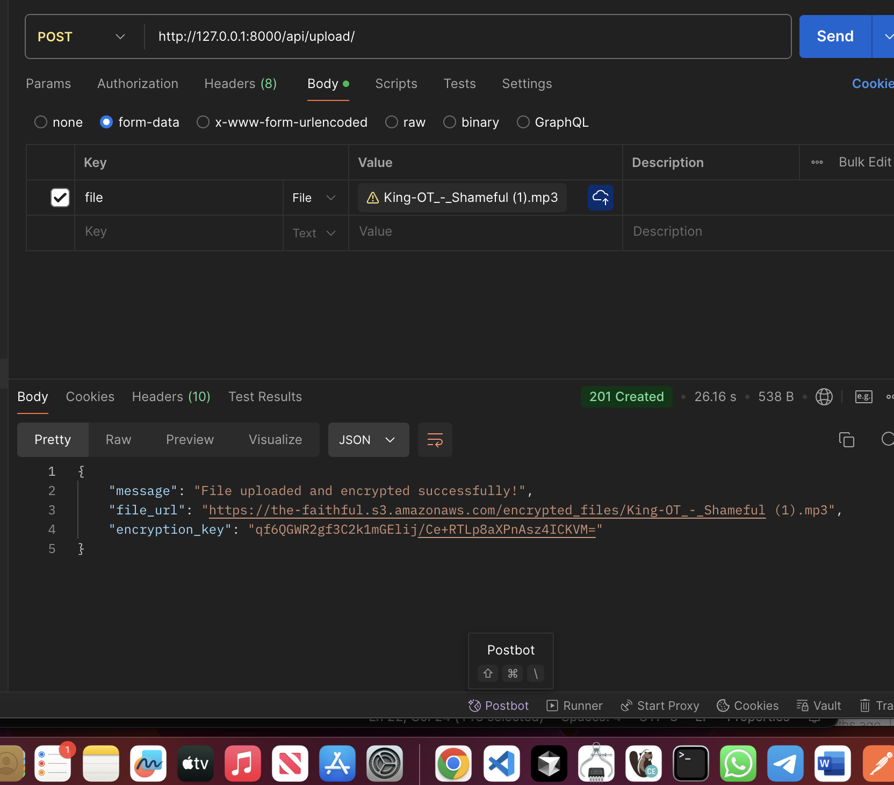

##  File Upload and Encryption API

This API endpoint allows users to securely upload files that are encrypted before being stored. The encryption process ensures that the file data remains confidential and protected from unauthorized access.

## How It Works

File Upload:

- Upload files through the API by sending a POST request with the file attached.
- The file data is received as bytes and prepared for encryption.

File Encryption:

- The uploaded file is encrypted using AES (Advanced Encryption Standard) with a 256-bit key.
- A unique initialization vector (IV) is generated for each file to ensure encryption security.
- The encryption process combines the file data with the IV, making the file unreadable without the correct key.

Secure Storage:

- The encrypted file data, along with the IV, is securely stored.
- The encryption key is managed separately and securely to prevent unauthorized decryption.

Error Handling:

- The API includes robust error handling to ensure that any issues during upload or encryption are properly - - - logged and communicated to the user.

API Usage:

- Endpoint: /api/upload/
- Method: POST

Parameters:

- file: The file to be uploaded and encrypted.

Response:

- Success: Returns a message confirming the file upload and encryption.
- Error: Returns an error message detailing the issue encountered during the process.

Security Benefits:

- By encrypting files upon upload, sensitive data is protected both during transmission and at rest.
- AES encryption ensures that only those with the correct decryption key can access the file contents.

requirements:

- Python 3.11

## How to run

### Linux/Mac

- create a .env file
- There are examples specific to your development enviroment. env.example is for development and You can copy the example files to .env and fill in the values.
- python3 -m venv venv
- source venv/bin/activate
- pip install -r requirements.txt
- python3 manage.py migrate
- python3 manage.py runserver

### Windows

- create a .env file
- There are examples specific to your development enviroment. env.example is for development and You can copy the example files to .env and fill in the values.
- python3 -m venv venv
- venv\Scripts\activate
- pip install -r requirements.txt
- python manage.py migrate
- python manage.py runserver

